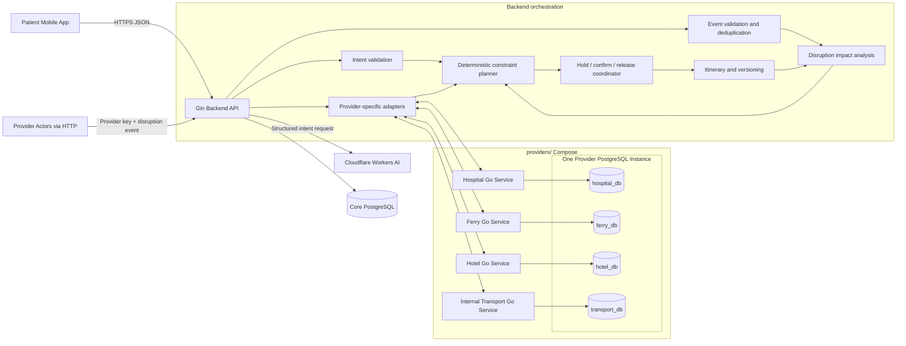

# Batam MedHub — Project Understanding

Status: contract-frozen v0.1; implementation not started

Last reviewed: 15 August 2026

## 1. Purpose of this document

This document records my current understanding of Batam MedHub before implementation begins. It separates:

- decisions stated in the latest project brief;
- guidance found in the read-only research repository;
- the actual state of this repository; and
- provisional assumptions that still need confirmation.

The latest project brief takes precedence whenever older research documents disagree with it. The research repository at `/home/bayuzzs/Documents/bsh-research` was used only as a knowledge source and was not modified.

All product UI, API names, source code, fixtures, and project documentation will be written in English. Indonesian may still be used for team conversations.

## 2. Executive understanding

Batam MedHub is a cross-border medical-journey orchestration platform for medical tourists travelling to Batam, initially from Singapore. It coordinates a hospital appointment with ferry travel, local transport, and accommodation, then keeps those services synchronized when a provider-side change disrupts the confirmed journey.

The challenge premise assumes that Batam's new International Health Tourism Special Economic Zone, backed by multi-billion investment and world-class hospital ambitions, is intended to attract Singaporean medical tourists. The infrastructure investment does not by itself solve the fragmented patient experience across booking, records, travel, post-care, and language boundaries.

Its core promise is:

> Turn one medical-trip request into one feasible, confirmable, and recoverable cross-provider journey.

Batam MedHub is not an AI doctor, a clinical recommendation engine, or merely a marketplace. A marketplace can show individually available services. Batam MedHub must prove that the selected services can work together under real constraints such as time zones, immigration and travel buffers, capacity, accessibility, offer expiry, and appointment timing.

The full challenge also mentions fragmented medical records, post-care follow-up, and multilingual support. The research evolved from a broad solution covering those areas into a narrower orchestration MVP, and those capabilities are now confirmed for a later phase.

## 3. Problem being solved

A Singapore-based patient planning a scheduled medical visit in Batam may need to coordinate several independent systems and organizations:

- a hospital service and appointment slot;
- an outbound ferry and its check-in cutoff;
- arrival and immigration time;
- local pickup and transfer to the hospital;
- a hotel when an overnight stay is required;
- local transport between journey stops;
- a safe return ferry; and
- changes and confirmations after the original plan is created.

Post-care follow-up is part of the challenge and broader product vision, but it is not yet an agreed capability of the first hackathon vertical slice.

Each component can be available on its own while the combined journey remains impossible. For example, an 08:00 hospital slot is not useful if the earliest ferry arrival plus immigration, transfer, and safety buffers makes 08:45 the earliest feasible arrival at the hospital.

The platform therefore owns cross-provider coordination and journey state. It does not replace the clinical authority of the hospital or the operational authority of each provider.

## 4. Users and system participants

The four provider categories are represented by standalone headless Go applications. They do not require dashboard UI in the first phase. Routine provider operations are called by the backend, while a provider actor can manually submit a disruption through the provider-authenticated backend API.

| Participant | Role in Batam MedHub |
|---|---|
| Patient or caregiver | Describes a planned medical trip, corrects extracted preferences, reviews plan options, approves logistics, and follows the active itinerary. |
| Hospital service | Exposes synthetic services and slots and responds to search, hold, confirm, and release operations. Its actor can submit provider-authored medical schedule changes. |
| Ferry service | Exposes synthetic sailings, cutoffs, capacity, and booking operations. Its actor can submit delays, schedule changes, or cancellations. |
| Hotel service | Exposes synthetic rooms, occupancy, accessibility, stay coverage, and booking operations. Its actor can submit room or reservation problems. |
| Internal transport service | Exposes synthetic vehicle or driver availability and assignment operations. Its actor can submit delays or unavailability. |
| Backend orchestrator | Owns validation, canonical models, planning, booking coordination, itinerary versions, disruption impact analysis, and recovery planning. |
| Cloudflare Workers AI | Converts natural-language input into structured intent only; it is not the planner or source of availability. |

A coordinator or hospital international-patient desk is part of the broader product vision, but no coordinator UI has yet been confirmed for the hackathon build.

## 5. Repository boundaries and current reality

The intended monorepo has three areas:

| Directory | Ownership and intended responsibility | Current state |
|---|---|---|
| `mobile/` | Patient-facing client, owned by another team member. This workstream must not modify it unless explicitly requested later. | Empty. |
| `backend/` | Core journey orchestration, intent validation, provider normalization, deterministic planning, booking, itinerary, and disruption handling. | Contains an untracked `go.mod` declaring module `batam-medhub` with Go `1.26.5` and workstream instructions; application code is not implemented. |
| `providers/` | Parent for four standalone headless Go provider applications—hospital, ferry, hotel, and internal transport—run together through Compose. | Contains workstream instructions only; provider application code is not implemented. The directory name is plural. |

The repository now has draft-v0.1 architecture documents, two OpenAPI contracts, golden JSON contract examples, and Codex workstream briefs. It still has no application source files, database migrations, runtime fixtures, tests, deployment configuration, or environment example. The tracked root `readme.md` still contains only `Hello World`; the new foundation files are not yet committed.

Nothing described below should therefore be read as already implemented.

## 6. Intended high-level architecture



The core backend remains a Go modular monolith with one system of record for Batam MedHub journey state. The four provider processes are external-system mocks with independent HTTP and persistence boundaries; they do not own Batam MedHub's core orchestration domain.

The backend remains the source of truth for Batam MedHub journey state. Mobile calls the backend contract. The backend calls provider services through provider-specific adapters, and provider actors submit disruptions through an authenticated backend route. The four providers share one PostgreSQL server and named volume, but each owns a separate logical database and database credential for its operational data. No service accesses another provider's database or the core database directly.

PostgreSQL is the confirmed persistence technology for the core backend and all four provider mocks. No schema or migration has been implemented yet.

## 7. Initial journey flow

The intended end-to-end planning flow is:

1. The patient submits a natural-language request for any provider-authored medical service available in the active catalog.
2. Cloudflare Workers AI extracts a structured intent object.
3. The backend treats the model output as untrusted and validates its schema, enums, types, dates, and ranges.
4. If required information is absent, the application asks one focused clarification instead of guessing.
5. The backend verifies the extracted service against the current medical-service catalog. A request with no matching service returns a clear `UNSUPPORTED_SERVICE` result instead of an invented recommendation.
6. Symptom interpretation, emergency triage, diagnosis, and choosing a treatment on the patient's behalf remain outside the normal planner and return a safe response.
7. The hospital provider is queried for matching appointment offers, with a bounded timeout. Independent provider-category searches are run concurrently where their inputs are already known, and one provider failure must not erase successful responses from another.
8. Hospital responses are normalized into canonical medical offers while preserving the provider's opaque offer IDs.
9. The medical appointment becomes the journey anchor.
10. The deterministic planner combines compatible ferry, transfer, hotel, and return options around that anchor.
11. Hard constraints remove impossible combinations before any scoring occurs.
12. The backend returns at most two explainable plan options.
13. The patient explicitly approves one plan.
14. The backend revalidates expiry and availability, then performs persisted mock-provider hold and confirmation operations over HTTP.
15. A successful confirmation creates immutable itinerary version 1.

The working initial state model is:

```text
DRAFT → PARSING_INTENT
PARSING_INTENT → NEEDS_INPUT → PARSING_INTENT
PARSING_INTENT → OUT_OF_SCOPE
PARSING_INTENT → UNSUPPORTED_SERVICE
PARSING_INTENT → PLANNING
PLANNING → NO_MATCH
PLANNING → PLAN_READY → CONFIRMING
CONFIRMING → ACTIVE | CONFIRMATION_FAILED | MANUAL_REVIEW
```

`NEEDS_INPUT` is a clarification loop rather than a mandatory linear step. `UNSUPPORTED_SERVICE`, `NO_MATCH`, `OUT_OF_SCOPE`, and `CONFIRMATION_FAILED` are expected terminal or recovery branches. Initial confirmation enters `MANUAL_REVIEW` only when a compensating release has an uncertain outcome; no journey is declared active, and every provider reference is retained for operational reconciliation. `ACTIVE` is the confirmed name for a successfully confirmed journey.

## 8. Structured-intent contract v0.1

The semantic resolution model is frozen for OpenAPI v0.1:

```json
{
  "schema_version": "1.0",
  "resolution": "MATCHED",
  "intent_category": "PREVENTIVE_CHECKUP",
  "requested_service_text": "basic medical check-up",
  "service_code": "MCU_BASIC",
  "candidate_service_codes": [],
  "origin_port": "HARBOURFRONT_SG",
  "date_window": {
    "from": "2026-08-22",
    "to": "2026-08-22"
  },
  "patient_count": 1,
  "companion_count": 1,
  "stay_type": "SAME_DAY",
  "budget": {
    "amount_minor": 40000,
    "currency": "SGD"
  },
  "preferences": {
    "language": "en",
    "hotel_tier": null,
    "accessibility": []
  },
  "missing_fields": [],
  "clarification_question": null,
  "out_of_scope_reason": null,
  "unsupported_reason": null
}
```

Required behavior:

- `MATCHED` means one active catalog service and all required planning fields are available.
- `NEEDS_CLARIFICATION` returns missing fields or candidate service codes plus one focused question.
- `UNSUPPORTED_SERVICE` means the explicitly requested service is not in the active catalog.
- `OUT_OF_SCOPE` covers symptom diagnosis, treatment selection, emergency planning, or another prohibited request.
- Numeric LLM confidence is not used for a business decision.
- Values not stated by the user must be `null` or appear in `missing_fields`; the model must not invent them.
- Unknown enum values must fail validation.
- The patient must be able to review and correct the extracted values.
- The LLM may identify a supported planned-care intent, extract preferences, generate a clarification, and explain already-computed results.
- The LLM must not diagnose symptoms, select treatment, determine fitness to travel, invent provider facts, override the planner, or book anything without approval.
- A service code returned by the LLM is only a candidate until the backend verifies it against the current PostgreSQL catalog.
- A disclosed deterministic fixture fallback should keep the demo usable if the model or network is unavailable.

The Go backend will call Cloudflare Workers AI directly behind an `IntentExtractor` interface. The rest of the backend remains independent of the model client and deterministic.

## 9. Planning and ranking rules

An option is feasible only when all applicable hard constraints pass:

- the requested provider-authored service and appointment slot exist;
- the appointment falls inside the requested date window;
- the ferry arrives early enough for arrival or immigration, transfer, and medical safety buffers;
- ferry check-in and return-terminal cutoffs can be met;
- itinerary items do not overlap;
- enough passenger, room, vehicle, and driver capacity exists;
- accessibility requirements are satisfied;
- accommodation covers every required night;
- return travel begins after the appointment and downstream buffers;
- every selected offer is still available and unexpired; and
- currency and time-zone values normalize successfully.

Scoring happens only after hard filtering. It may use schedule fit, budget fit, travel effort, stated preferences, offer freshness, and provider response reliability. It must remain explainable and non-clinical.

Recommended wording:

> Best fit for your travel preferences.

Prohibited positioning:

> Best hospital, best doctor, or best clinical outcome.

No solver or autonomous AI agent is required for the small hackathon dataset. A deterministic loop is sufficient and easier to test and explain.

## 10. Synthetic demo invariant

The research repository contains optional reusable planning ideas, all explicitly fictional:

- four planned services: `MCU_BASIC`, `MCU_COMPREHENSIVE`, `DENTAL_CHECKUP`, and `EYE_SCREENING`;
- several synthetic hospital and appointment variants;
- two synthetic ferry operators and six sailings between HarbourFront and Batam Centre; and
- three synthetic hotels with four room offers.

The frozen contract uses one canonical same-day scenario. Its clearest orchestration proof is deliberately encoded in the data:

```text
Ferry arrival at Batam Centre     07:40 WIB
Arrival / immigration buffer     45 minutes
Transfer to hospital             45 minutes
Medical arrival buffer           50 minutes
Selected appointment             10:00 WIB
```

- An 08:00 appointment offer is infeasible because the patient is still in the arrival/transfer sequence.
- The 10:00 `MCU_BASIC` appointment is the canonical selected offer.
- A later seeded appointment may support a second feasible plan when useful for the demo.

This demonstrates actual orchestration more clearly than simply returning the highest-ranked hospital.

These fixtures should be copied only when their schemas match the backend's canonical contracts. Any copied runtime fixture must retain visible `synthetic: true` and `source: MOCK` markers. Prices, availability, provider names, schedules, locations, and confirmations must never be presented as real operational data.

## 11. Booking semantics and consistency

The system must distinguish four concepts:

| Concept | Meaning |
|---|---|
| Catalog offering | A service generally published by a provider. |
| Offer | A specific slot, price, source, and expiry. |
| Hold | A temporary reservation while the full journey is being confirmed. |
| Reservation | A provider-confirmed booking result. |

The target production pattern is an orchestration-based saga:

```text
hold hospital
→ hold ferry
→ hold hotel when needed
→ hold transport
→ confirm all
```

If one operation fails, newly created holds are released. Confirmed cleanup produces `CONFIRMATION_FAILED`; a timeout or another uncertain release outcome produces `MANUAL_REVIEW`, retains all external references, and never declares a journey active. Every mutating operation needs an idempotency key so repeated requests or double-clicks cannot create duplicate trips, reservations, events, or itineraries.

The hackathon implementation may simulate this synchronously, but its visible state transitions should still be honest.

## 12. Disruption and replanning

The backend must use one generic disruption pipeline for all four provider categories. At minimum, the event catalog must support a representative trigger from each source:

- hospital: additional care or appointment change;
- ferry: delay, schedule change, or cancellation;
- hotel: reservation or room availability problem; and
- internal transport provider: delayed or unavailable transfer.

These are event types, not four separately implemented replanning engines. Every event is normalized into one canonical contract and processed by the same validation, impact analysis, constraint planner, booking coordinator, and itinerary-versioning flow.

The disruption model distinguishes:

- **Event:** a new fact received from a patient or provider.
- **Impact:** one or more active itinerary constraints become invalid.
- **Disruption:** an event that creates an impact.
- **Recovery:** a feasible set of changes that restores the journey.

A provider event is not automatically a disruption. A short ferry delay that remains inside existing buffers may only require a notification.

For `HOSPITAL_ADDITIONAL_CARE_REQUESTED`, the hospital—not Batam MedHub or the LLM—provides the follow-up service, explicit time window, duration, priority, travel clearance, operational requirements, and instruction reference. The request is invalid without that instruction reference. The demo uses `FOLLOWUP_OBSERVATION` as provider-only hospital recovery inventory: it is intentionally absent from the patient-requestable core medical-service catalog, and the backend must search, hold, and confirm its provider offer through the normal HTTP reservation lifecycle before adding it to a recovery itinerary.

The intended flow is:

1. Authenticate or identify the provider source, normalize the event, validate it, and deduplicate it.
2. Load itinerary version 1 without modifying it.
3. Stop automatic travel planning when the provider reports a clinical or travel hold.
4. Calculate which downstream items are affected.
5. Generate at most two feasible recovery options.
6. Show added, changed, removed, and unchanged items, plus signed `time_delta_minutes` and signed price deltas relative to the active itinerary. A positive time delta means the recovered journey finishes later; a negative value means it finishes earlier.
7. Request approval for logistical changes only, not medical consent.
8. Revalidate and hold all replacement services.
9. Confirm replacements before releasing superseded reservations.
10. Activate itinerary version 2 and mark version 1 `SUPERSEDED`.
11. Enter `MANUAL_REVIEW` when no safe plan exists or confirmation fails.

The suggested recovery demonstration is:

- Option A: a later same-day driver and return ferry.
- Option B: an additional hotel night, new transfer, and next-day ferry.

For the deterministic same-day golden demo, the synthetic hospital event requests a 12:00–13:30 WIB observation. The replacement transfer runs 13:45–14:30 WIB, which makes the original 14:30 return sailing impossible while a 16:00 sailing remains feasible. These times are demo fixtures, not operational claims.

The proposed disruption lifecycle is:

```text
DETECTED → VALIDATING
VALIDATING → IGNORED | ANALYZING
ANALYZING → NO_ACTION | CLINICAL_HOLD | MANUAL_REVIEW | REPLAN_READY
REPLAN_READY → AWAITING_APPROVAL
AWAITING_APPROVAL → APPLYING | MANUAL_REVIEW
APPLYING → RESOLVED | RECOVERY_FAILED
RECOVERY_FAILED → MANUAL_REVIEW
```

The product can expose disruption simulations for every provider category while the three-minute presentation demonstrates only one primary event in depth.

## 13. Provider mock services

`providers/` contains four standalone, headless Go applications:

```text
providers/
├── docker-compose.yml
├── Dockerfile
├── go.mod
├── cmd/
│   ├── hospital/main.go
│   ├── ferry/main.go
│   ├── hotel/main.go
│   └── transport/main.go
├── migrations/
│   ├── hospital/
│   ├── ferry/
│   ├── hotel/
│   └── transport/
└── internal/mockprovider/
```

This uses one Go module to share minimal mock-provider plumbing while Compose runs four independent application containers plus one shared PostgreSQL container. That PostgreSQL instance contains `hospital_db`, `ferry_db`, `hotel_db`, and `transport_db` on one named volume. Each application has its own database credentials and migration history. The PostgreSQL initialization script creates one owner per database, revokes public cross-database connection privileges, and grants each provider access only to its own database. Four separate Go modules are unnecessary unless the services later need independent release lifecycles.

Each application represents one provider system and exposes only the capabilities needed by the orchestrator:

| Provider service | Minimum mock API behavior | Provider-owned persistent data |
|---|---|---|
| Hospital | Search services and slots; hold, confirm, and release appointments. | Services, appointment slots, holds, and reservations. |
| Ferry | Search sailings and capacity; hold, confirm, and release seats. | Sailings, seat capacity, holds, and reservations. |
| Hotel | Search rooms and stay coverage; hold, confirm, and release rooms. | Room inventory by date, holds, and reservations. |
| Internal transport | Search vehicle or driver availability; hold, confirm, and release assignments. | Fleet, driver or vehicle availability, holds, and assignments. |

Routine search, hold, confirm, and release responses are automatic. No provider dashboard UI is required.

A provider actor manually applies disruption by calling the provider-authenticated backend route with the corresponding provider secret. The secret authenticates the provider organization, not the individual human. Until provider-user authentication exists, the request therefore includes a provider-asserted actor snapshot such as `actor_id`, `name`, and `role`; this is useful audit context but is not independently verified. If time remains, a provider UI can later be built against the same OpenAPI contract.

The backend resolves provider identity and type from the verified secret rather than trusting a `provider_id` sent in the request body. It rejects an event type that is incompatible with that authenticated provider type, or a target reservation/itinerary item that does not belong to both the authenticated provider and the stated journey, with `403`. The deduplication key is the authenticated provider plus `external_event_id`: an identical body fingerprint replays the original outcome, while reuse with a changed body returns `409`. The exact header and key-management convention is defined in OpenAPI. Ferry, hotel, and transport actors must not receive the raw patient prompt, medical intent, diagnosis, or medical records.

Each provider uses GORM for its own PostgreSQL access and `golang-migrate/migrate` SQL files for its own schema. Runtime GORM `AutoMigrate` remains disabled. Deterministic seed data is inserted through idempotent seed commands or migrations, and demo reset explicitly clears and reseeds provider-owned state instead of relying on a process restart.

## 14. Contracted API surface

OpenAPI was not created in isolation before the domain was understood. The design gate produced the aligned artifacts in this order:

1. domain vocabulary and journey/disruption state transitions;
2. a minimal ERD showing ownership, relations, and database invariants;
3. `specs/openapi.yaml`, derived from that model and used as the mobile contract;
4. `specs/provider-openapi.yaml`, used as the backend-to-provider contract; and
5. versioned SQL migrations, which are the next implementation artifact.

This is still an OpenAPI-first implementation workflow: the API contract is frozen before mobile, backend, and provider integration code proceed in parallel. It does not mean skipping data modelling.

Recommended documentation locations:

```text
docs/architecture/domain-model.md
docs/architecture/erd.md
docs/architecture/state-machines.md
specs/openapi.yaml
specs/provider-openapi.yaml
specs/examples/
backend/migrations/
providers/migrations/{hospital,ferry,hotel,transport}/
```

The minimal core ERD should cover providers and keys, the supported medical-service catalog and provider capability mappings, trip requests, plan options and normalized offer snapshots, journeys and itinerary versions, reservations, provider events and actor snapshots, disruption cases, replan options, and static exchange rates. Separate provider data models cover their operational offers, slots, sailings, rooms, vehicle availability, capacity, holds, and reservations. Those records remain provider-owned; the core database must not become a second live inventory source of truth.

The confirmed stack is Gin for HTTP, GORM for PostgreSQL data access and transactions, and `golang-migrate/migrate` for versioned SQL migrations in both the core backend and all four provider services. Each datastore has its own SQL migration history and schema authority; runtime GORM `AutoMigrate` must not create or change tables.

The control plane owns both contracts under `specs/**`; implementation workers consume them read-only. `specs/openapi.yaml` is the mobile-facing Batam MedHub API, while `specs/provider-openapi.yaml` documents the backend-to-provider mock protocol so the four Go services can be implemented consistently.

OpenAPI v0.1 defines the following minimal patient and orchestration operations:

```text
GET    /healthz
GET    /readyz
GET    /v1/medical-services
POST   /v1/trip-requests
PATCH  /v1/trip-requests/{id}/intent
POST   /v1/trip-requests/{id}/plans
GET    /v1/trip-requests/{id}
POST   /v1/plan-options/{id}/confirm
GET    /v1/journeys/{id}/itinerary
GET    /v1/journeys/{id}/itineraries/{version}

POST   /v1/provider/disruptions
GET    /v1/disruptions/{id}
POST   /v1/recovery-options/{id}/approve

POST   /v1/demo/reset
```

`specs/provider-openapi.yaml` defines backend-to-provider search, hold, confirm, lookup, and release operations. Provider-authored disruptions are defined only in the core backend contract because actors submit them directly to `POST /v1/provider/disruptions`.

The aggregate distinction is: `TripRequest` represents the planning request before confirmation, while `Journey` represents the confirmed, versioned journey. OpenAPI v0.1 is the contract authority for API naming.

## 15. Safety, privacy, and cross-border rules

- Use only synthetic patient, provider, price, inventory, booking, and document data in the hackathon.
- Collect initial intent progressively and minimally. Do not request passport data, disease history, medications, allergies, or medical documents during the first planning prompt.
- Collect identity or travel-document data only later, and only when a selected provider reservation explicitly requires it. The hackathon must still use synthetic values.
- Do not log raw medical prompts to public analytics services.
- Send each partner only the minimum operational data required for its role.
- Keep API keys and model credentials in environment variables.
- Treat all LLM and provider payloads as untrusted input.
- Store instants in UTC and retain the source IANA time zone. Singapore uses `Asia/Singapore` (UTC+8), while Batam uses `Asia/Jakarta` (UTC+7).
- Display local times and zones explicitly to avoid ambiguous itineraries.
- Store money as an integer minor-unit amount using that currency's ISO 4217 exponent plus an ISO currency code, never as floating point.
- Preserve the provider's original amount and currency as source-of-truth money.
- Read the patient's display-currency preference from a verified JWT claim. Backend responses should return both source money and converted display money, including the FX rate source, rate timestamp, and an estimated/reference indicator.
- Retain offer source, freshness, expiry, and external reference.
- Never let AI rewrite provider-authored clinical or preparation instructions.
- A production pilot would require real consent, access control, encryption, audit, retention, legal review, and partner agreements; the hackathon must not claim these are complete.
- Domain models may be FHIR-inspired, but the project must not claim a live FHIR, SATUSEHAT, hospital, ferry, or hotel integration.

The UI, API descriptions, and project documentation remain English. Multilingual product support is deferred to the next phase. Clinical translation must remain provider-controlled or human-reviewed if it is added later.

## 16. Confirmed scope decisions

The following decisions are now confirmed:

- Medical service support is catalog-driven. Users may request any active service in the medical-service catalog; an unmatched request returns `UNSUPPORTED_SERVICE`.
- One canonical disruption engine accepts events from hospital, ferry, hotel, and the internal transport provider.
- Medical records, post-care follow-up, and multilingual product support are next-phase capabilities.
- A confirmed journey uses state `ACTIVE`.
- The patient's verified JWT includes a reference-currency preference. The backend converts prices for display while preserving original provider money.
- Transport is an internal provider.
- Provider authentication uses provider-specific secret keys.
- Hospital, ferry, hotel, and transport are four standalone headless Go services under `providers/docker-compose.yml`.
- Provider search, hold, confirm, and release are automatic; provider actors manually submit disruptions through the authenticated backend route.
- The Go backend calls Cloudflare Workers AI directly.
- PostgreSQL is used by the core backend and every provider. The providers share one PostgreSQL instance and volume but have four separate logical databases and credentials.
- The core backend and all provider mock services use Gin, GORM, and `golang-migrate/migrate` within their own persistence boundary.
- The control plane owns OpenAPI under `specs/`; backend and provider workers consume it read-only.
- Reference-currency conversion uses static, timestamped rates rather than a live FX dependency.
- Research fixtures may be copied only when they match the canonical backend schema.
- Feature implementation comes first. Automated unit, integration, and end-to-end tests will be implemented in a dedicated phase after the application flow is ready.

### First feature-complete vertical slice

- Active medical-service catalog and unsupported-service response.
- Natural-language request to validated structured intent.
- Missing-field clarification and safe out-of-scope behavior.
- Appointment-anchored, deterministic constraint planning.
- At most two explainable plan options.
- Source and reference-currency price responses.
- Explicit approval and idempotent hold, confirm, and release simulation.
- Immutable `ACTIVE` itinerary v1 in PostgreSQL.
- Four provider services running through Compose, each with its own persisted logical PostgreSQL database in the shared provider instance, and authenticated at their backend integration boundaries.
- Provider disruption route that can be invoked manually with the relevant provider secret.
- One event type from every provider category through the shared disruption pipeline.
- One polished recovery flow that books provider-only `FOLLOWUP_OBSERVATION` inventory through normal search/hold/confirm operations and produces itinerary v2.
- Deterministic demo reset and visible synthetic-data labels.

### Next phase

- Medical records or document upload.
- Readiness checklist, consent, or a role-based Care Pass.
- Post-care follow-up workflow.
- Multilingual product behavior.
- Coordinator or admin dashboard.
- Payment, refund, insurance, and real provider integrations.

## 17. Suggested demo story

One coherent demo can prove both initial orchestration and recovery:

1. Rina, travelling from Singapore with one companion, requests a same-day basic MCU trip in English.
2. Workers AI returns reviewable structured intent, and the backend verifies the service against the active catalog.
3. The planner rejects an 08:00 appointment offer because the ferry and buffers make it unreachable.
4. It shows at most two feasible appointment-anchored plans, with non-clinical reasons and prices in Rina's reference currency.
5. Rina approves one plan and receives mock confirmation references and `ACTIVE` itinerary v1.
6. A provider actor manually calls the authenticated disruption route with a provider secret; the demo selects one hospital event for the detailed path while fixtures cover every provider type.
7. The backend shows the affected pickup and return ferry and proposes at most two recoveries.
8. Rina approves the logistical change.
9. Replacement holds are confirmed before old reservations are released.
10. The application displays `ACTIVE` itinerary v2 and preserves v1 as `SUPERSEDED`.

The story supports the product message:

> The hospital changes one part of the care journey; Batam MedHub safely updates everything affected by that change.

## 18. Hackathon delivery and judging priorities

The local hackathon FAQ states:

- the build window is 16 hours on 15–16 August 2026;
- the submission requires a public repository, written documentation, a three-minute demo video, and a short pitch deck;
- AI models, datasets, pre-existing code, and pre-existing assets must be disclosed;
- judging includes problem relevance, technical execution, innovation, impact and feasibility, and presentation; and
- the stage presentation should be in English.

The repository will therefore eventually need honest AI and synthetic-data disclosures. Any research fixtures or pre-existing assets copied into this repository must be identified as such.

At minimum, the repository documentation package should include a real project `README`, architecture documentation, the backend-owned OpenAPI specification, setup and demo instructions, and the required AI/data/pre-existing-asset disclosures.

The provided judging preference is:

| Criterion | Weight |
|---|---:|
| Technical Execution & Engineering Quality | 25% |
| Problem Understanding & Relevance | 20% |
| Innovation & Creativity | 20% |
| Impact & Feasibility | 20% |
| Presentation & Demo | 15% |

Technical execution has the highest single weight. The implementation should therefore make the engineering evidence visible:

- OpenAPI-first contracts and consistent domain vocabulary.
- PostgreSQL persistence across the core and provider boundaries rather than disconnected UI state.
- Provider-specific adapters and a canonical provider-event envelope.
- Deterministic planning and impact analysis; AI remains at the language boundary.
- Idempotency, event deduplication, partial provider failure, immutable itinerary versions, and safe booking compensation.
- Honest source/reference currency conversion metadata.
- A repeatable end-to-end demo using real state transitions.

RAG or a broad autonomous agent should not be added merely to match a judging keyword. Availability, prices, inventory, bookings, and schedules are transactional structured data. The technical explanation should show why structured LLM output plus deterministic tool boundaries is safer and more appropriate.

Per the project owner's sequencing decision, automated tests are deferred until the application features are ready. Compilation, migration execution, OpenAPI validation, and repeatable manual smoke flows should still remain feature-completion gates; the later test phase should focus first on planner constraints, money conversion, provider authentication, idempotency, and itinerary version changes.

## 19. Initial demo catalog

The v0.1 deterministic seed starts with MCU Basic, MCU Comprehensive, Dental Check-up, and Eye Screening. The architecture remains catalog-driven, so later services are data additions rather than API redesigns.

## 20. Current working assumptions

- The latest brief overrides older research recommendations.
- `mobile/` remains untouched.
- The backend is a Go modular monolith and the sole orchestration source of truth; the control plane owns `specs/`, which implementation workers consume read-only.
- The domain model, ERD, state machines, and both OpenAPI v0.1 contracts are frozen before implementation workstreams branch.
- Gin handles HTTP, GORM handles data access, and `golang-migrate/migrate` SQL files are the only schema-migration authority.
- Core PostgreSQL stores catalog, planning, booking, journey, provider-event, disruption, and reference-exchange-rate state.
- Provider secrets resolve provider identity and role server-side.
- Four standalone Gin provider services run through `providers/docker-compose.yml`; they share one PostgreSQL server while each owns a separate logical database, and their routine booking behavior is automatic and seed-backed.
- The internal transport provider uses the same integration principles as the other provider categories.
- One generic event pipeline supports all provider sources; one path is polished for the presentation.
- Static exchange rates are stored with source and timestamp metadata and frozen into confirmed itinerary price snapshots.
- All data and confirmations are synthetic and visibly labeled.
- Records, post-care workflows, multilingual behavior, payments, real integrations, and production compliance controls remain next-phase work.
- Feature implementation precedes the dedicated automated-testing phase.

## 21. Sources consulted

Repository:

- `readme.md`
- `backend/go.mod`
- current `mobile/`, `backend/`, and `providers/` directory contents

Read-only research context:

- `design.md`
- `class-diagram.drawio`
- `docs-brainstorming/Batam_MedHub_MVP_PRD.md`
- `docs-brainstorming/Batam_MedHub_Implementation_Architecture.md`
- `docs-brainstorming/Batam_MedHub_Disruption_Flow.md`
- `docs-brainstorming/chat_handoff_batam_singapore_hackathon_2026.md`
- `docs-brainstorming/alternatif_ide_hackathon_tourism_batam_2026.md`
- `docs-brainstorming/SAMBUNG_Care_Batam_Hackathon_Proposal.docx`
- `docs-brainstorming/Hackathon Batam MedHub.pdf`
- `docs-brainstorming/Batam_Singapore_Hackathon_2026_FAQs (1).pdf`
- `docs-brainstorming/synthetic-data/README.md`
- `docs-brainstorming/synthetic-data/medical_services.json`
- `docs-brainstorming/synthetic-data/ferries.json`
- `docs-brainstorming/synthetic-data/hotels.json`

The older `design.md`, class diagram, and SAMBUNG Care proposal are useful background, but the newer PRD, implementation architecture, disruption flow, and latest user brief are the stronger implementation references.
