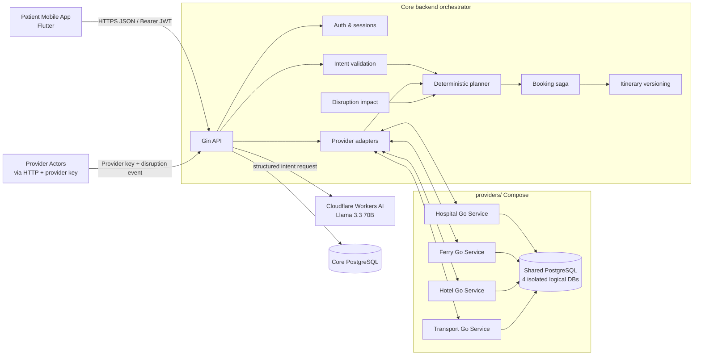
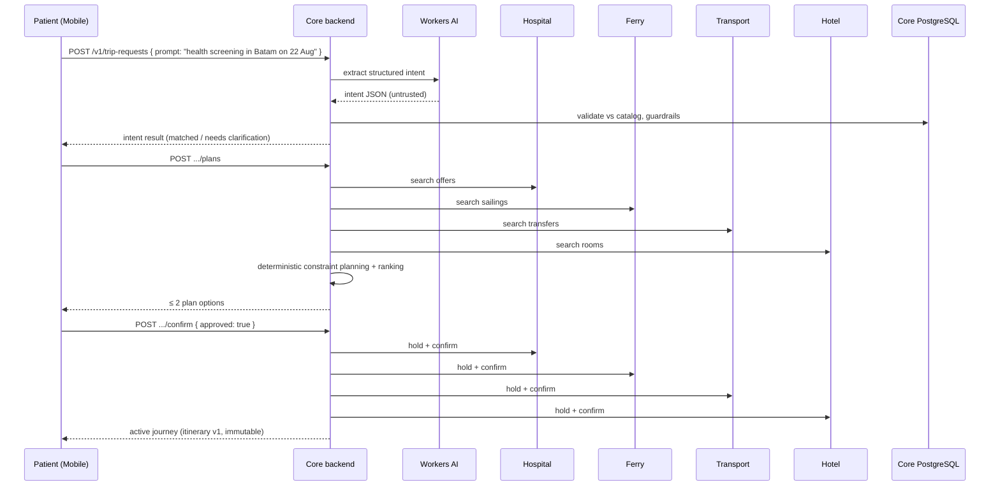
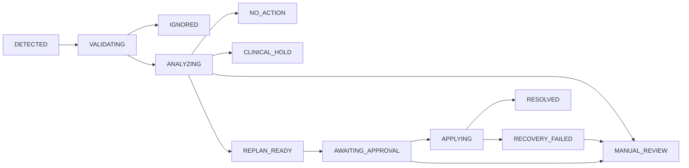

# Batam MedHub — System Architecture

> Related documents: [domain model](architecture/domain-model.md) ·
> [state machines](architecture/state-machines.md) · [logical ERD](architecture/erd.md)

This page describes how Batam MedHub is built and why. It walks from the
highest-level system picture down to the request flows a judge would care about:
planning, booking, and disruption recovery.

---

## 1. Design principles

1. **The orchestrator owns the journey.** No single provider can prove that a
   hospital slot, a ferry, a transfer, and a hotel fit together. Batam MedHub
   owns cross-provider coordination and journey state.
2. **Services communicate only over HTTP.** The core backend never reads a
   provider database and providers never read each other's databases. Each
   provider owns its data and its authority.
3. **AI is a bounded, untrusted component.** AI converts natural language into
   structured intent. It does not diagnose, choose treatment, invent
   availability, plan constraints, or book anything.
4. **Planning is deterministic.** For the hackathon dataset, a constraint-based
   planner is more reliable, explainable, and testable than an autonomous agent.
5. **Money and time are exact.** Money is integer minor units with ISO currency
   codes; schedules are UTC instants that retain IANA time zones.

---

## 2. System context



**Participants**

| Participant | Role |
| :--- | :--- |
| Patient / caregiver | Registers, describes a trip in natural language, corrects preferences, approves a plan, follows the active itinerary. |
| Hospital service | Publishes synthetic services and slots; search / hold / confirm / release. |
| Ferry service | Publishes synthetic sailings, cutoffs, and capacity; search / hold / confirm / release. |
| Hotel service | Publishes synthetic rooms and stay coverage; search / hold / confirm / release. |
| Internal transport service | Publishes synthetic driver/vehicle availability; search / hold / confirm / release. |
| Core orchestrator | Validates intent, plans, coordinates booking, versions itineraries, analyzes disruptions, and recovers journeys. |
| Cloudflare Workers AI | Converts natural-language input into structured intent only. |

---

## 3. Component breakdown

### 3.1 Mobile app — `mobile/`

A **Flutter** patient client (Riverpod + GoRouter + Dio). Screens:

- **Auth** — login and registration with secure token storage.
- **Chat** — the primary screen. The patient types a trip request; the app
  routes on the intent result: asks a clarification, shows plan options, or
  explains unsupported/out-of-scope reasons.
- **Plan detail** — an itemized journey timeline (each leg's time, provider,
  price, and operational notes) plus the planner's explanation.
- **Active itinerary** — the confirmed journey with booking reference and
  per-leg status chips.
- **History / Profile** — past journeys and the patient profile.

A deterministic **fake backend** is the default so the demo works without any
infrastructure; the real Dio backend can be switched on via a single flag.

### 3.2 Core backend — `backend/`

A Go **modular monolith** (Gin + GORM + PostgreSQL) with these bounded contexts:

- **Auth & sessions** — Argon2id password hashing, short-lived HS256 access
  JWTs, rotating opaque refresh tokens (only SHA-256 hashes stored), idempotent
  logout.
- **Intent extraction** (`internal/ai`) — calls Cloudflare Workers AI, validates
  the structured intent against the catalog, applies clinical guardrails, and
  falls back to a deterministic rule extractor when AI is unavailable.
- **Provider adapters** (`internal/adapter`) — normalizes each provider's offers
  into canonical offers while preserving opaque provider offer IDs.
- **Planner** — deterministic, appointment-anchored constraint planner that
  produces at most two explainable plan options.
- **Booking saga** (`internal/service/saga.go`) — two-phase holds followed by
  sequential confirms, with automatic compensation on failure.
- **Disruption & recovery** (`internal/service/disruption.go`) — normalizes
  provider events, deduplicates them, analyzes impact, generates recovery
  options, and activates immutable itinerary version 2.
- **Demo management** — `POST /v1/demo/reset` restores the golden demo state.

### 3.3 Provider services — `providers/`

Four standalone headless Go applications (one shared Go module) — hospital,
ferry, hotel, transport — each exposing `search / hold / confirm / release`
operations. They share one PostgreSQL server with **four isolated logical
databases** (`hospital_db`, `ferry_db`, `hotel_db`, `transport_db`) and separate
credentials. No service can reach another provider's database.

---

## 4. Core request flow (happy path)



Key behavior:
- The medical appointment is the **anchor** of the journey; ferry, transfer,
  and hotel options are planned around it.
- Hard constraints (ferry cutoff, immigration buffer, appointment time,
  capacity, accessibility, stay coverage, non-overlap, expiry) are applied
  **before** any scoring.
- Independent provider searches run concurrently; one provider failure must not
  erase successful responses from another.
- The planner returns **at most two explainable options** and explicitly says
  "best fit for your travel preferences" — never "best hospital/doctor".

---

## 5. Booking saga (consistency without a shared transaction)

The orchestrator coordinates four independent providers using an
orchestration-based saga:

```text
hold hospital → hold ferry → hold hotel (when needed) → hold transport → confirm all
```

- Every orchestration mutation carries an **idempotency key**, so retries or
  double-clicks cannot create duplicate trips, holds, or reservations.
- If any step fails, newly created holds are **released** (compensating
  actions). Confirmed cleanup produces `CONFIRMATION_FAILED`; an uncertain
  release produces `MANUAL_REVIEW`, retains all external references, and never
  declares the journey active.
- State transitions are honest: `CONFIRMING → ACTIVE | CONFIRMATION_FAILED |
  MANUAL_REVIEW`.

---

## 6. Disruption & recovery

One **generic disruption pipeline** handles every provider category. A provider
actor submits an event (e.g. ferry delay, doctor's follow-up request); the
backend normalizes, validates, and deduplicates it (SHA-256 fingerprints).



The recovery pipeline:

1. Load itinerary v1 **without modifying it**.
2. Stop automatic travel planning when a provider reports a clinical or travel
   hold.
3. Determine which downstream items are affected.
4. Generate **at most two feasible recovery options** with signed
   `time_delta_minutes` and price deltas relative to the active itinerary.
5. Request approval for **logistical changes only** — never medical consent.
6. Revalidate and hold replacements; confirm replacements **before** releasing
   superseded reservations.
7. Activate itinerary **v2** and mark v1 `SUPERSEDED`.

The canned demo event is a hospital request for a 12:00–13:30 WIB observation;
the replacement transfer makes the original return sailing infeasible, and a
later sailing is selected — proving orchestration rather than a simple search.

---

## 7. State machines

Full lifecycles are documented in [state-machines.md](architecture/state-machines.md).
The working initial state model:

```text
DRAFT → PARSING_INTENT
PARSING_INTENT → NEEDS_INPUT → PARSING_INTENT
PARSING_INTENT → OUT_OF_SCOPE
PARSING_INTENT → UNSUPPORTED_SERVICE
PARSING_INTENT → PLANNING
PLANNING → NO_MATCH
PLANNING → PLAN_READY → CONFIRMING
CONFIRMING → ACTIVE | CONFIRMATION_FAILED | MANUAL_REVIEW
```

`NEEDS_INPUT` is a clarification loop; `OUT_OF_SCOPE`, `UNSUPPORTED_SERVICE`,
`NO_MATCH`, and `CONFIRMATION_FAILED` are explicit terminal/recovery branches.

---

## 8. Data model

The domain model and logical ERD are in [domain-model.md](architecture/domain-model.md)
and [erd.md](architecture/erd.md). High-level:

- **Core DB (backend-owned):** patients, auth sessions, profiles, medical
  service catalog, trip requests, intents, plan options, journeys, immutable
  itinerary versions and items, holds, reservations, disruption events, and
  recovery options.
- **Provider DBs (provider-owned):** each provider's inventory (services/slots,
  sailings/capacity, rooms/stay coverage, fleet/availability), holds, and
  reservations.
- Money is stored in **integer minor units** with ISO currency codes (e.g.
  IDR/SGD); FX conversion returns both source and display money.
- SQL migrations (via `golang-migrate`) are the schema authority; there is no
  runtime `AutoMigrate`.

---

## 9. Cross-cutting concerns

| Concern | Approach |
| :--- | :--- |
| **Security** | Argon2id passwords, HS256 access JWTs, rotating refresh tokens, provider integration keys (`X-Integration-Key`), demo reset secret, rate limiting. |
| **AI trust boundary** | Model output is schema-validated, enum-checked, catalog-verified, and never used for a business decision on numeric confidence. |
| **Idempotency** | Idempotency keys on every orchestration mutation; retries are safe. |
| **Money** | Integer minor units + ISO 4217; no binary floating point. |
| **Time** | UTC instants with explicit IANA zones (e.g. `Asia/Jakarta`, `Asia/Singapore`). |
| **Determinism** | Same input → same plan; explainable, testable, demoable offline. |
| **Deployability** | Docker Compose + nginx + HTTPS at `https://api.bayumaulana.my.id` (see `deploy/`). |

---

## 10. Key engineering trade-offs (for the presentation)

- **Modular monolith instead of microservices for the core** — one system of
  record, simpler saga, easy to reason about, while providers stay separate to
  preserve real-world boundaries.
- **Deterministic planner instead of an autonomous agent** — for the small
  hackathon dataset this is more robust, explainable, and testable; it avoids
  hallucinated availability.
- **Synchronous saga instead of async message broker** — honest state
  transitions with idempotency; a broker was explicitly out of scope.
- **LLM for intent only, never for decisions** — this is what keeps the product
  safe and the demo reliable.
