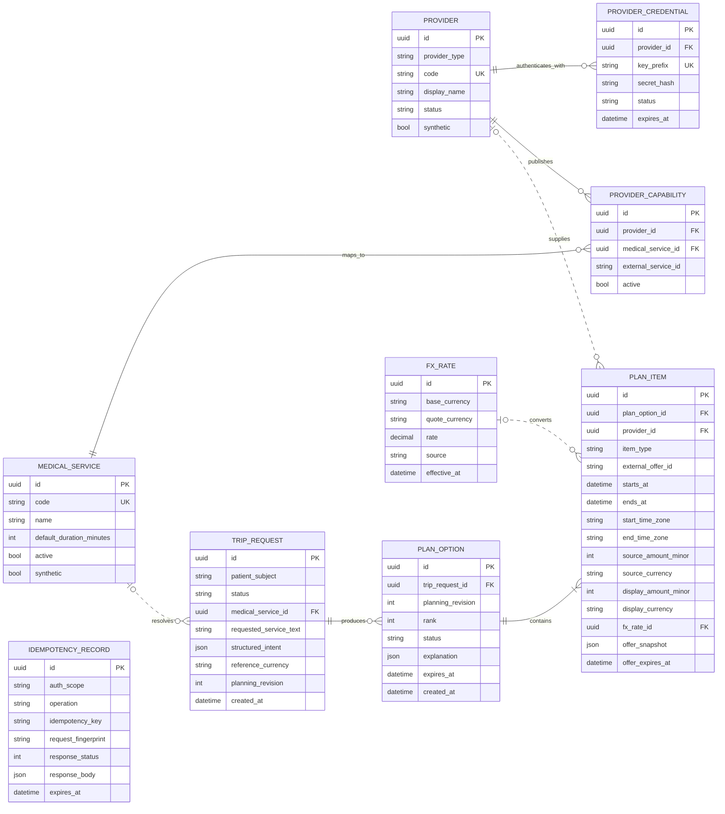
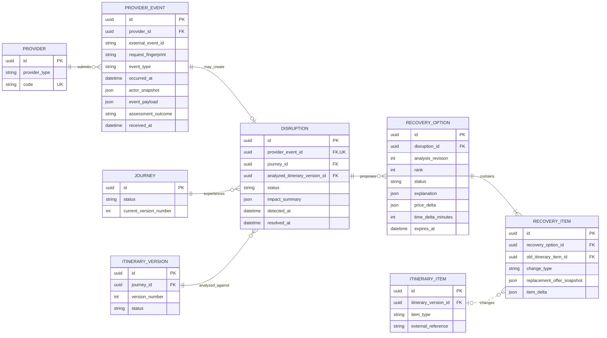
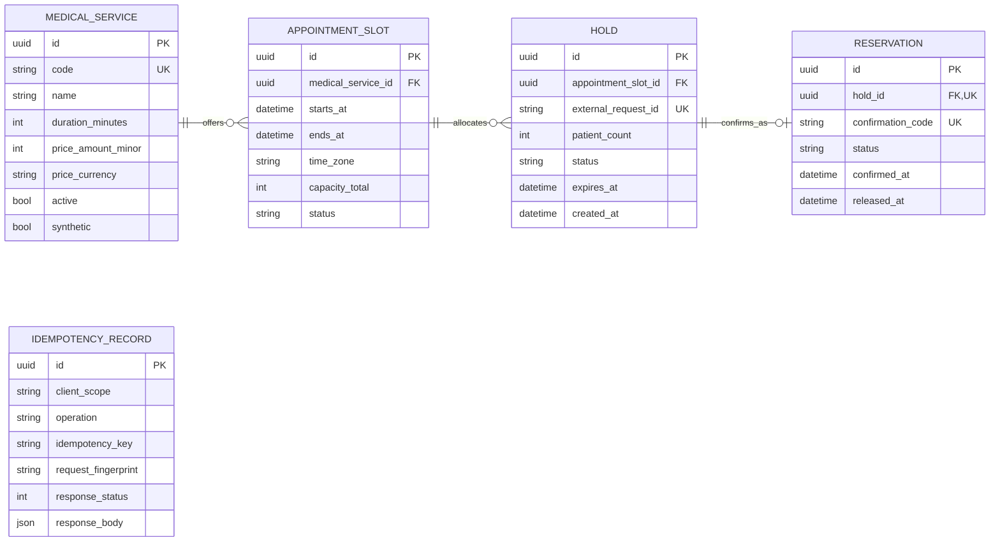
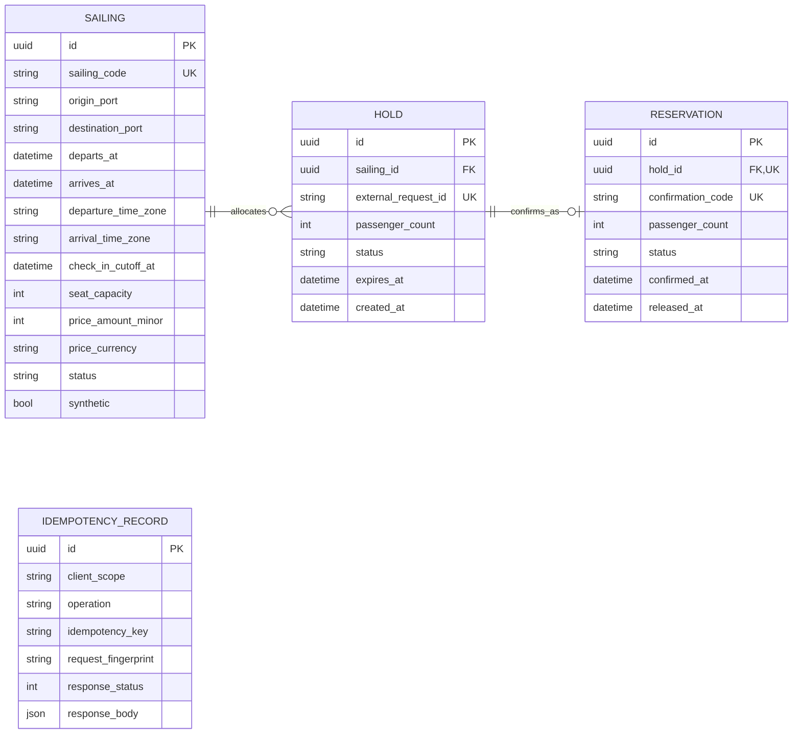
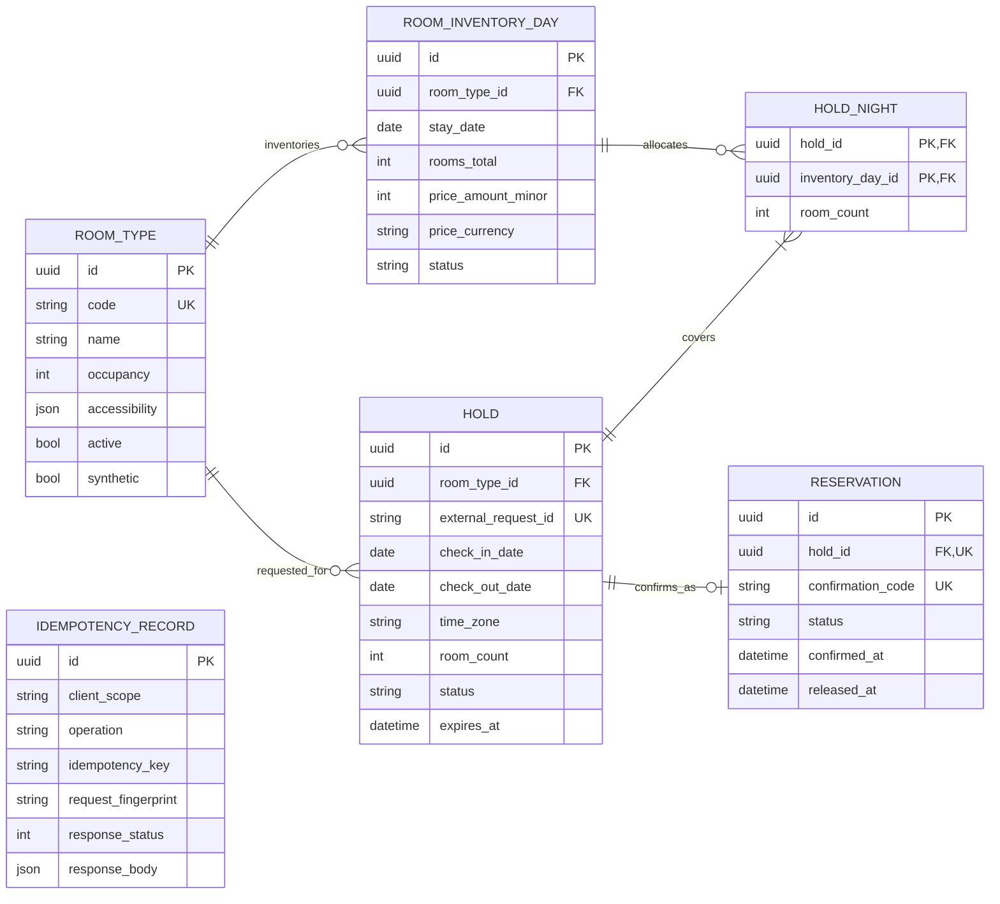
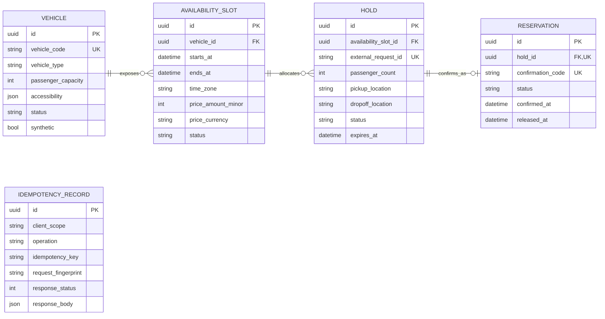

# Batam MedHub Logical ERD

Status: contract draft v0.1
Scope: first hackathon vertical slice

## Reading this document

These are logical models used to align OpenAPI and migrations. They intentionally show only identity, ownership, important state, and money/time fields. SQL migrations remain the physical-schema authority for exact PostgreSQL types, indexes, checks, and deletion behavior.

All internal IDs are UUIDs. Provider-owned external IDs remain opaque strings. All timestamps represent UTC instants unless a separate IANA `time_zone` is retained for local display.

## Core PostgreSQL

The core database is the Batam MedHub system of record for planning, orchestration, journeys, and disruption recovery. It stores provider snapshots and external references, not live provider inventory.

### Reference data and planning

Important constraints not expressible as Mermaid cardinalities:

- `(provider_id, medical_service_id, external_service_id)` is unique for an active capability mapping.
- Only a provider with type `HOSPITAL` may own a medical-service capability.
- `(trip_request_id, planning_revision, rank)` is unique, and one planning revision exposes at most two options.
- A `PlanItem.provider_id` is nullable only for non-bookable operational steps such as immigration or safety buffers.
- A `PlanItem` copies conversion metadata into its snapshot; `fx_rate_id` preserves provenance but does not make a historical price dependent on a mutable rate.
- `(auth_scope, operation, idempotency_key)` is unique. The same key with another fingerprint is rejected.

### Booking, journey, and itinerary versioning

```mermaid
erDiagram
    direction LR

    TRIP_REQUEST ||--o| JOURNEY : becomes
    TRIP_REQUEST ||--o{ RESERVATION : coordinates
    PLAN_ITEM ||--o| RESERVATION : books
    PROVIDER ||--o{ RESERVATION : owns_externally
    JOURNEY o|..o{ RESERVATION : includes
    JOURNEY ||--|{ ITINERARY_VERSION : versions
    ITINERARY_VERSION ||--|{ ITINERARY_ITEM : contains
    RESERVATION o|..o{ ITINERARY_ITEM : represented_by

    TRIP_REQUEST {
        uuid id PK
        string patient_subject
        string status
        uuid selected_plan_option_id FK
    }

    PLAN_ITEM {
        uuid id PK
        uuid plan_option_id FK
        uuid provider_id FK
        string item_type
        string external_offer_id
    }

    PROVIDER {
        uuid id PK
        string provider_type
        string code UK
    }

    RESERVATION {
        uuid id PK
        uuid trip_request_id FK
        uuid journey_id FK
        uuid plan_item_id FK
        uuid provider_id FK
        string status
        string external_hold_id
        string external_reservation_id
        datetime hold_expires_at
        json provider_snapshot
        datetime updated_at
    }

    JOURNEY {
        uuid id PK
        uuid trip_request_id FK, UK
        string patient_subject
        string status
        int current_version_number
        datetime activated_at
    }

    ITINERARY_VERSION {
        uuid id PK
        uuid journey_id FK
        int version_number
        string status
        string change_reason
        uuid source_disruption_id FK
        datetime activated_at
    }

    ITINERARY_ITEM {
        uuid id PK
        uuid itinerary_version_id FK
        uuid reservation_id FK
        string item_type
        int sequence_number
        datetime starts_at
        datetime ends_at
        string start_time_zone
        string end_time_zone
        int source_amount_minor
        string source_currency
        int display_amount_minor
        string display_currency
        json snapshot
    }
```

Important constraints:

- `TripRequest` has zero or one `Journey`; a journey is created only after all required reservations confirm.
- `Reservation.journey_id` is nullable while confirmation is in progress.
- `(journey_id, version_number)` and `(itinerary_version_id, sequence_number)` are unique.
- A partial unique constraint permits only one `ACTIVE` itinerary version per journey.
- Activated itinerary versions and their items are append-only. Recovery creates a successor version.
- A reservation can appear in multiple versions when an unchanged booking is carried forward.
- Bookable itinerary items reference a core reservation; operational buffer items do not.

### Provider events, disruption, and recovery

Important constraints:

- `(provider_id, external_event_id)` is unique. A replay returns the existing result only when `request_fingerprint` matches; a different body is a conflict and does not create another disruption.
- `ProviderEvent.event_type` must be compatible with the authenticated provider's type. Every referenced reservation or itinerary item must belong to both that provider and the event's journey.
- One provider event creates zero or one disruption. A valid event with no itinerary impact records `NO_ACTION` on the event assessment and creates no disruption resource.
- `(disruption_id, analysis_revision, rank)` is unique, and one revision exposes at most two recovery options.
- `RecoveryItem.change_type` is `ADDED`, `CHANGED`, `REMOVED`, or `UNCHANGED`.
- `old_itinerary_item_id` is nullable for an added item. A removed item has no replacement offer.
- Actor details are a provider-asserted JSON snapshot; there is no provider-user table in this slice.

## Provider PostgreSQL topology

| PostgreSQL server | Logical database | Application role | Direct access allowed |
|---|---|---|---|
| Provider PostgreSQL | `hospital_db` | Hospital service credential | `hospital_db` only |
| Provider PostgreSQL | `ferry_db` | Ferry service credential | `ferry_db` only |
| Provider PostgreSQL | `hotel_db` | Hotel service credential | `hotel_db` only |
| Provider PostgreSQL | `transport_db` | Transport service credential | `transport_db` only |

There are no relationships across these diagrams. Similar names such as `HOLD` and `RESERVATION` describe the shared provider protocol but are separate tables and records in each database.

### `hospital_db`

Availability is `capacity_total` minus active, non-expired holds and confirmed reservations, calculated while locking the appointment slot row.

### `ferry_db`

Seat availability is calculated transactionally from sailing capacity, active holds, and confirmed reservations.

### `hotel_db`

`(room_type_id, stay_date)` is unique. A hold succeeds only when every night in `[check_in_date, check_out_date)` has enough inventory in one transaction.

### `transport_db`

Availability windows for the same vehicle must not overlap once held or confirmed, and passenger/accessibility requirements must fit the vehicle.

## Provider-wide database invariants

1. `HOLD.status` is `HELD`, `CONFIRMED`, `RELEASED`, or `EXPIRED`; terminal states are not reopened.
2. `RESERVATION.status` is `CONFIRMED` or `RELEASED`.
3. Confirm accepts only a non-expired `HELD` record and creates at most one reservation per hold.
4. Release is idempotent for both a hold and a confirmed reservation.
5. Expired holds do not consume availability and are transitioned lazily during access or by a small cleanup job.
6. Each capacity check and hold creation locks the relevant inventory rows in one provider transaction.
7. `(client_scope, operation, idempotency_key)` is unique, and request fingerprints must match on replay.
8. Provider databases store no raw medical prompt, medical record, or cross-provider itinerary.
