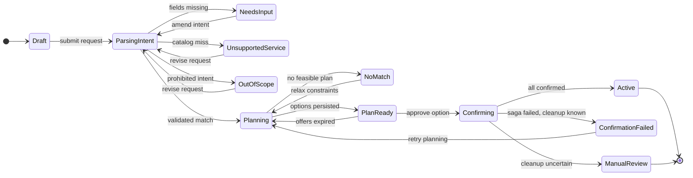
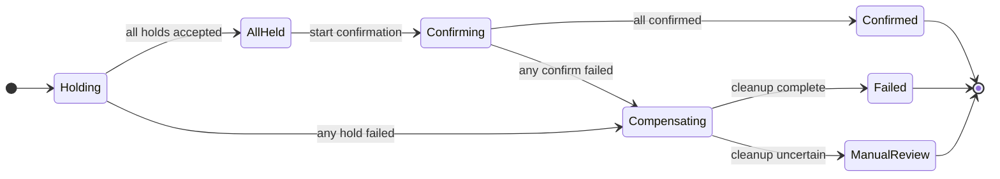
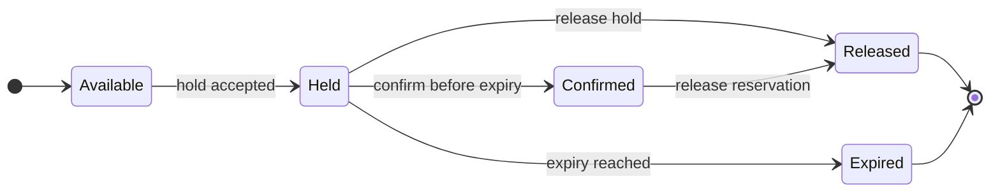
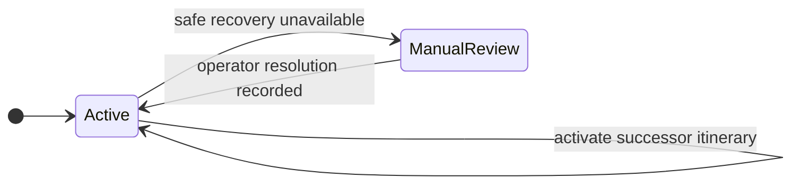
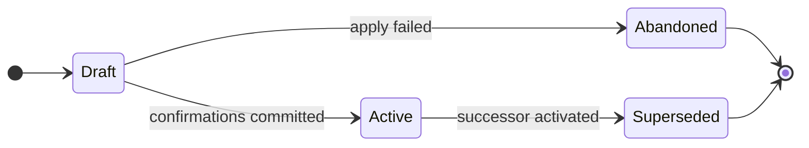
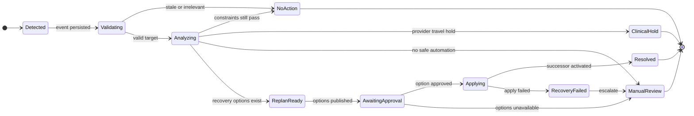
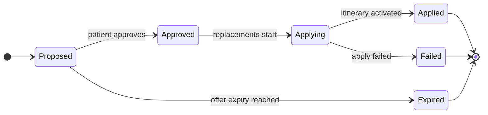

# Batam MedHub State Machines

Status: contract draft v0.1
Scope: first hackathon vertical slice

## Conventions

- State names are uppercase in APIs and databases; diagrams use title case for readability.
- A transition occurs only after its guard passes.
- Invalid transitions return a conflict and do not partially mutate state.
- Retried mutating requests with the same idempotency key return the original outcome.
- Provider HTTP calls are never enclosed in a core PostgreSQL transaction.

## Trip-request workflow

This is the patient-visible orchestration workflow stored on `TripRequest`. `ACTIVE` means confirmation produced a linked active `Journey`; the journey remains the owner of all later itinerary and disruption changes.

| From | Event and guard | To | Required action |
|---|---|---|---|
| `DRAFT` | Request submitted | `PARSING_INTENT` | Invoke the intent extractor or disclosed deterministic fallback. |
| `PARSING_INTENT` | Resolution is `NEEDS_CLARIFICATION` | `NEEDS_INPUT` | Persist validated partial intent and one focused question. |
| `NEEDS_INPUT` | Patient supplies an answer | `PARSING_INTENT` | Merge only allowed corrections and validate again. |
| `PARSING_INTENT` | Explicit requested service is absent from active catalog | `UNSUPPORTED_SERVICE` | Return the unsupported result; do not query providers. |
| `PARSING_INTENT` | Diagnosis, treatment selection, emergency planning, or another prohibited request | `OUT_OF_SCOPE` | Return the safe scope response; do not plan. |
| `PARSING_INTENT` | Resolution is `MATCHED`, required fields exist, and catalog service is active | `PLANNING` | Increment planning revision and query provider searches with bounded timeouts. |
| `PLANNING` | Hard filtering leaves no feasible combination | `NO_MATCH` | Persist the reason categories without inventing availability. |
| `PLANNING` | One or two feasible options exist | `PLAN_READY` | Persist ranked option and offer snapshots with expiry. |
| `PLAN_READY` | Patient approves an unexpired option owned by the same JWT subject | `CONFIRMING` | Lock selection and begin the booking saga. |
| `PLAN_READY` | Any required offer expired before approval | `PLANNING` | Invalidate stale options and create a new revision. |
| `CONFIRMING` | Every required reservation confirmed | `ACTIVE` | Atomically create the journey, itinerary v1, and links to core reservation records. |
| `CONFIRMING` | A hold/confirm fails and every compensation result is known | `CONFIRMATION_FAILED` | Persist the failed outcome; no journey is created. |
| `CONFIRMING` | A compensating release times out or has another uncertain result | `MANUAL_REVIEW` | Retain all provider references and expose an operational cleanup flag; no journey is created. |
| Outcome state | Patient materially revises the request or constraints | `PARSING_INTENT` or `PLANNING` | Start a new revision; never rewrite old plan snapshots. |

Intent resolution and workflow state are related but distinct:

| Structured-intent resolution | Workflow result |
|---|---|
| `MATCHED` | May enter `PLANNING` after backend validation |
| `NEEDS_CLARIFICATION` | `NEEDS_INPUT` |
| `UNSUPPORTED_SERVICE` | `UNSUPPORTED_SERVICE` |
| `OUT_OF_SCOPE` | `OUT_OF_SCOPE` |

## Core booking saga

This workflow is coordinated by the core and represented by `TripRequest.status` plus its core `Reservation` rows. It is not a distributed database transaction.

| Stage | Guard | Core reservation changes |
|---|---|---|
| `HOLDING` | Revalidate every offer; call providers in deterministic order with one idempotency key per operation. | Create/update rows as `PENDING`, then `HELD` with external hold ID and expiry. |
| `ALL_HELD` | Every required hold exists and remains unexpired. | No provider state change. |
| `CONFIRMING` | Confirm each valid hold. | Move each successful row to `CONFIRMED` with external reservation ID. |
| `COMPENSATING` | A hold or confirmation failed. | Release newly created holds and, where supported, newly confirmed reservations in reverse order. |
| `CONFIRMED` | Every required provider reservation is confirmed. | Create journey and active itinerary v1 in one core transaction. |
| `FAILED` | Compensation completed or was idempotently already complete. | Set trip request to `CONFIRMATION_FAILED`; no journey is created. |
| `MANUAL_REVIEW` | A provider release timed out or returned an uncertain result. | Keep exact external references and surface an operational cleanup flag; no journey is declared active. |

One provider timeout must not be interpreted as a successful mutation. A retry uses the same idempotency key to discover the authoritative outcome.

Core reservation states are `PENDING`, `HELD`, `CONFIRMED`, `RELEASED`, and `FAILED`. A core row records the last authoritative provider result; it does not override the provider's record.

## Provider hold and reservation lifecycle

The same lifecycle applies independently inside `hospital_db`, `ferry_db`, `hotel_db`, and `transport_db`. `AVAILABLE` is a derived search result, not a persisted booking row.

| From | Command and guard | To | Provider transaction |
|---|---|---|---|
| `AVAILABLE` | Hold request is valid and sufficient capacity exists | `HELD` | Lock relevant inventory, recheck capacity, insert hold, and set expiry. |
| `HELD` | Confirm request matches the hold and `now < expires_at` | `CONFIRMED` | Mark hold confirmed and insert exactly one confirmed reservation. |
| `HELD` | Release request | `RELEASED` | Mark hold released; capacity becomes available. |
| `HELD` | Provider observes `now >= expires_at` | `EXPIRED` | Mark expired lazily or through cleanup; capacity becomes available. |
| `CONFIRMED` | Release request for compensation/replacement | `RELEASED` | Mark reservation and originating hold released atomically. |

Idempotent repeats of hold, confirm, or release return the original resource when the request fingerprint matches. `RELEASED` and `EXPIRED` are terminal. A confirm after expiry is rejected even if cleanup has not yet updated the stored status.

## Journey and itinerary versions

`Journey` owns the long-lived confirmed trip. `ItineraryVersion` owns immutable snapshots of that trip.

### Journey

| From | Event and guard | To | Action |
|---|---|---|---|
| Start | Confirmation saga succeeds | `ACTIVE` | Create journey with active itinerary v1. |
| `ACTIVE` | Recovery confirmations succeed | `ACTIVE` | Activate successor itinerary; journey remains usable. |
| `ACTIVE` | Clinical hold, no safe option, failed recovery, or uncertain compensation | `MANUAL_REVIEW` | Stop automatic changes and preserve all references. |
| `MANUAL_REVIEW` | An authorized operational resolution is recorded | `ACTIVE` | Activate or restore one valid itinerary version. |

Completion and patient cancellation are deliberately outside the first vertical slice.

### Itinerary version

| From | Guard | To | Invariant |
|---|---|---|---|
| `DRAFT` | Every required reservation for this version is confirmed | `ACTIVE` | Activation and previous-version supersession occur in one core transaction. |
| `DRAFT` | Replacement booking or core commit fails | `ABANDONED` | The draft is retained for audit but never displayed as current. |
| `ACTIVE` | A confirmed successor version is activated | `SUPERSEDED` | Old items remain immutable and queryable. |

A partial unique database constraint enforces at most one `ACTIVE` version per journey.
The current-itinerary operation and `GET /v1/journeys/{journey_id}/itineraries/{version}` return full immutable item contents; superseding a version never makes its contents inaccessible.

## Provider-event assessment and disruption recovery

Provider actors submit events manually to the core disruption endpoint. The verified provider secret determines the provider identity. The event body must not be trusted to choose that identity. Before persistence, the core verifies that the event type is compatible with the authenticated provider type and that every target reservation or itinerary item belongs to both that provider and the stated journey; an ownership/type mismatch returns `403`.

The diagram combines event assessment and the later disruption workflow. `NO_ACTION` is a provider-event receipt outcome and does not create a `Disruption` resource. Invalid requests return the normal API problem response and create no event. An operationally impactful event returns `DISRUPTION_CREATED`; its persisted disruption status is one of `DETECTED`, `VALIDATING`, `ANALYZING`, `CLINICAL_HOLD`, `MANUAL_REVIEW`, `REPLAN_READY`, `AWAITING_APPROVAL`, `APPLYING`, `RESOLVED`, or `RECOVERY_FAILED`.

| From | Guard | To | Required action |
|---|---|---|---|
| `DETECTED` | Authenticated event passes schema, provider-type compatibility, target ownership, and deduplication checks | `VALIDATING` | Store immutable `ProviderEvent` with provider identity, actor snapshot, and request-body fingerprint. |
| `VALIDATING` | Event is stale, targets no active journey item, or is operationally irrelevant | `NO_ACTION` | Record the receipt outcome and reason; do not create a disruption. |
| `VALIDATING` | Target active itinerary and provider reference resolve | `ANALYZING` | Load the active itinerary without modifying it. |
| `ANALYZING` | All hard constraints still pass after applying event facts | `NO_ACTION` | Keep itinerary active; return impact/notification only. |
| `ANALYZING` | Hospital states that travel or planning must stop | `CLINICAL_HOLD` | Stop automatic replanning; require a new provider clearance event. |
| `ANALYZING` | Required facts are insufficient or no safe recovery can be generated | `MANUAL_REVIEW` | Preserve current state and explain why automation stopped. |
| `ANALYZING` | One or two feasible recovery options exist | `REPLAN_READY` | Persist option deltas and expiries. |
| `REPLAN_READY` | Options are ready for the patient | `AWAITING_APPROVAL` | Expose added, changed, removed, unchanged, signed `time_delta_minutes`, and signed price delta. |
| `AWAITING_APPROVAL` | Patient approves an owned, unexpired option | `APPLYING` | Revalidate and hold all replacements. |
| `AWAITING_APPROVAL` | All options expire or become unavailable | `MANUAL_REVIEW` | Do not silently choose another option. |
| `APPLYING` | Replacement reservations confirm and core activation commits | `RESOLVED` | Activate itinerary v2, supersede v1, then release superseded provider reservations. |
| `APPLYING` | Replacement hold/confirm or core activation fails | `RECOVERY_FAILED` | Compensate new resources; keep old itinerary/version history intact. |
| `RECOVERY_FAILED` | Compensation finishes or remains uncertain | `MANUAL_REVIEW` | Retain all external IDs for operational follow-up. |

An identical `(provider_id, external_event_id)` replay returns the existing provider-event/disruption outcome only when its request-body fingerprint matches; it does not execute these transitions again. Reusing the pair with a different body returns `409` and does not mutate the stored event.

For `HOSPITAL_ADDITIONAL_CARE_REQUESTED`, the hospital payload must include `instruction_reference` and the other contracted hospital-authored facts. The demo's `FOLLOWUP_OBSERVATION` is provider-only recovery inventory, not a patient-requestable core catalog service. The recovery saga searches, holds, and confirms that offer normally before activating the successor itinerary.

After v2 is active, failure to release a superseded reservation is recorded as cleanup-required and must not roll the journey back to v1.

## Recovery-option lifecycle

| State | Meaning |
|---|---|
| `PROPOSED` | Feasible when calculated and available for review. |
| `APPROVED` | Selected by the journey owner; sibling options are no longer selectable. |
| `APPLYING` | Replacement hold/confirm saga is running. |
| `APPLIED` | Its successor itinerary version is active. |
| `EXPIRED` | A required replacement offer expired before approval. |
| `FAILED` | Replacement application failed and compensation was attempted. |

Approval is for logistical changes only. It is not medical consent and cannot modify provider-authored clinical instructions.
